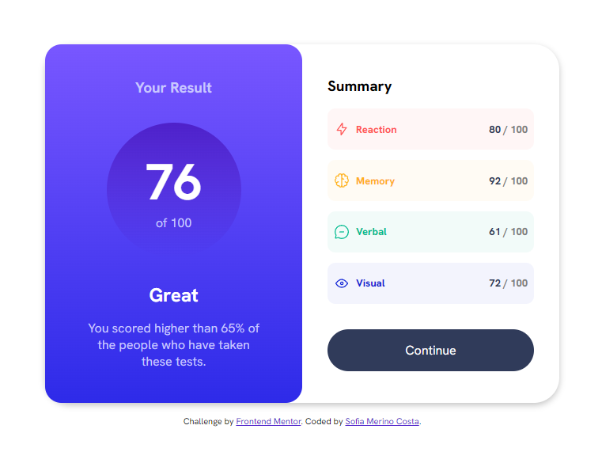

# Frontend Mentor - Results summary component solution 

This is a solution to the [Results summary component challenge on Frontend Mentor](https://www.frontendmentor.io/challenges/results-summary-component-CE_K6s0maV). Frontend Mentor challenges help you improve your coding skills by building realistic projects. 

## Table of contents

- [Overview](#overview)
  - [The challenge](#the-challenge)
  - [Screenshot](#screenshot)
  - [Links](#links)
- [My process](#my-process)
  - [Built with](#built-with)
  - [What I learned](#what-i-learned)
  - [Continued development](#continued-development)
  - [Useful resources](#useful-resources)
- [Author](#author)

**Note: Delete this note and update the table of contents based on what sections you keep.**

## Overview

### The challenge

Users should be able to:

- View the optimal layout for the interface depending on their device's screen size
- See hover and focus states for all interactive elements on the page

### Screenshot

### Links

- Solution URL: [Frontend Mentor](https://your-solution-url.com](https://www.frontendmentor.io/solutions/results-summary-component-with-html-and-css-coDr-5CvID)
- Live Site URL: [Github Pages](https://your-live-site-url.com](https://sophie-mc-dev.github.io/results-summary-component/)

## My process

### Built with

- Semantic HTML5 markup
- CSS custom properties
- Flexbox
- CSS Grid

### What I learned

- More about CSS Layout

### Continued development

- Apply the correct sizes of the page elements: font-size, padding, margins, etc.

## Author

- LinkedIn - [Sofia Merino Costa](https://www.linkedin.com/in/sofia-m-costa/)
- Frontend Mentor - [@agirlhasnoname07](https://www.frontendmentor.io/profile/agirlhasnoname07)

